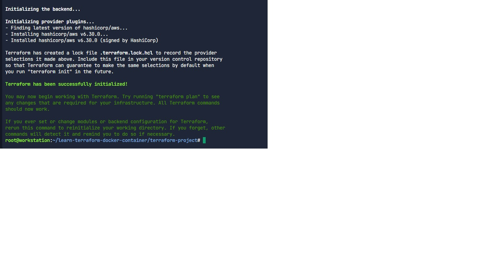
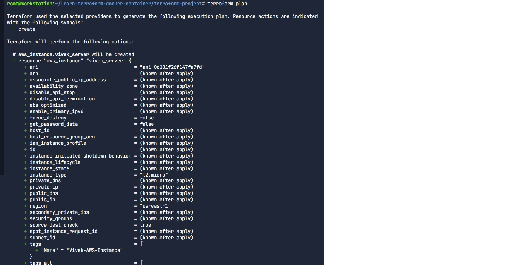

# AWS EC2 Infrastructure as Code
**Intern:** Vivek Joshi

## Project Summary
Provisioned an AWS EC2 instance using Terraform. 

## Technical Highlights
- **Program Association:** AWS Academy
- **Infrastructure:** EC2 Instance (t2.micro)
- **Validation:** Successfully executed `terraform plan` to verify resource logic.

## Challenges Resolved
Managed environment constraints by utilizing a sandbox terminal and verified the code syntax and resource mapping despite credential limitations.

## Proof of Work

### 1. Terraform Initialization

### 2. Execution Plan

**Note:** The configurations were validated through `terraform plan`. The subsequent `apply` step used mock credentials for security purposes as per the **AWS Academy** sandbox environment standards.
